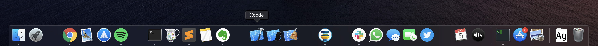
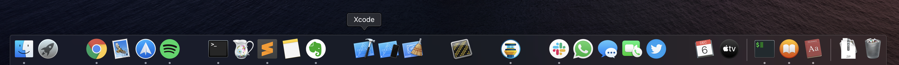

# new-mac

The things I do when setting up a new Mac

## Setup shell

- [ ] Install [homebrew](https://brew.sh)
- [ ] Install [wget](https://www.gnu.org/software/wget/) `brew install wget`
- [ ] Install [cask](https://github.com/Homebrew/homebrew-cask) `brew install cask`
- [ ] Install [Caskfile](Caskfile) and [Brewfile](Brewfile)
- [ ] Install [iTerm 3](https://www.iterm2.com/version3.html)
- [ ] Login locally on [GitHub](https://help.github.com/en/github/getting-started-with-github/set-up-git)
- [ ] follow [which terminal](https://github.com/iSame7/which-terminal)
- [ ] Login to heroku
- [ ] Install [zeit now](https://zeit.co/) `npm install -g now`

## Twitter

- [ ] Login to all accounts

## Sublime Text

- [ ] Migrate settings
- [ ] Install plugins

## Finder

- [ ] Show Path Bar `View` -> `Show Path Bar`
- [ ] Remove labels and clean up Sidebar

## Touch bar 

- [ ] Remove Siri and add Screen Lock in touch bar

## Dock

- [ ] Auto-hide dock
- [ ] Remove all the  things
- [ ] Arrange dock by adding empty spaces to keep an overview. `defaults write com.apple.dock persistent-apps -array-add '{"tile-type"="spacer-tile";}'` `killall Dock`

## Install and setup

- [ ] Google Drive
- [ ] [Telegram](https://itunes.apple.com/us/app/telegram/id747648890?mt=12)
- [ ] [Aware](https://itunes.apple.com/us/app/aware/id1082170746?mt=12)
- [ ] [Bartender](https://www.macbartender.com/)
- [ ] [Spark](https://sparkmailapp.com/)
- [ ] [Little Snitch](https://www.obdev.at/products/littlesnitch/index.html)
- [ ] [Micro Snitch](https://www.obdev.at/products/microsnitch/index.html)
- [ ] [NSLogger](https://github.com/fpillet/NSLogger)

## Mac App Store

- [ ] [Trello](https://itunes.apple.com/us/app/trello/id1278508951?mt=12)
- [ ] Twitter
- [ ] Evernote
- [ ] DevCleaner for Xcode
